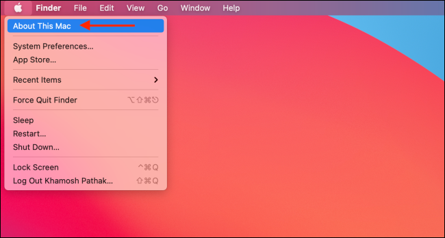
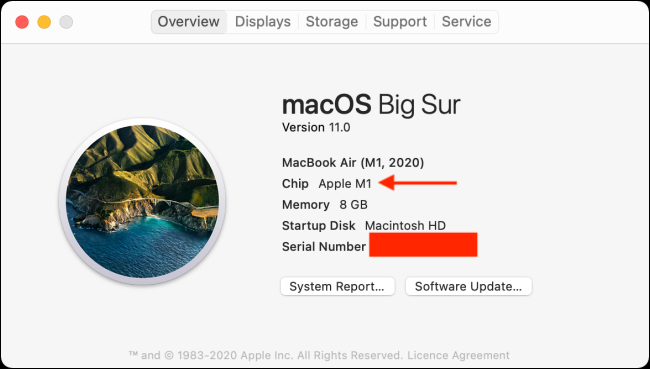
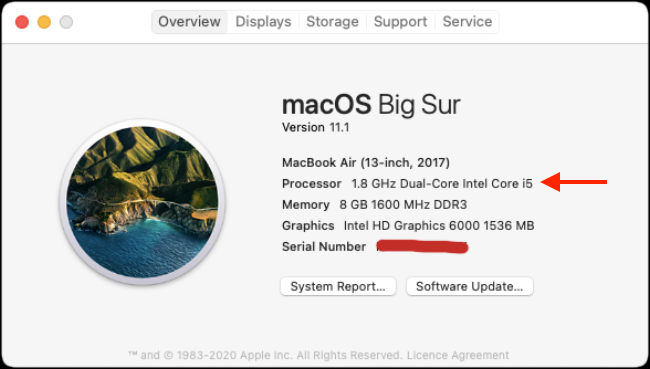

# M1 Installation

NOTE: **THESE INSTRUCTIONS ARE ONLY FOR M1 MACS, please use the [installation instructions](set-up.html) if you do not have an M1 Mac. We strongly recommend that you use one of the provided Virtual Machines (VM) and follow these instructions in your own time. Details on how to log on and access the VM will be provided during the workshop.**

How to check if you have an M1 Mac:

1. Click the `About this Mac` in the drop down menu from the top left corner of the screen


2. If the popup displays `Chip Apple M1`(see image below) - you have an M1 Mac computer with all its assorted problems with R package installations and you might need the instructions below to troubleshoot installing the packages required for this workshop. However, we strongly recommend using a VM for the workshop and to try these instructions in your own time



Alternatively if you see something like this:



You shouldn't have too much grief getting the packages installed and should follow these [installation instructions.](set-up.html)


## Instructions That Should Work

From the installation instructions, the steps below work on R.4.2

```{r, eval=FALSE}

install.packages(c("Seurat", "dplyr", "remotes", "R.utils"))

install.packages("BiocManager")
BiocManager::install(c('SingleR', 'celldex',
                       'BiocGenerics', 'DelayedArray', 'DelayedMatrixStats',
                       'limma', 'S4Vectors', 'SingleCellExperiment',
                       'SummarizedExperiment', 'batchelor', 'Matrix.utils'),
                     update=FALSE)

remotes::install_github("plotly/plotly.R")
remotes::install_github("pfh/langevitour")
```


## Instructions That Will Fail

```{r, eval=FALSE}
remotes::install_version("RcppArmadillo", version="0.11.2.4.0")
remotes::install_version("harmony", version="0.1", upgrade="never")
```

## Troubleshooting installation on M1 Mac with R.4.2:

1. Do not install any packages from source - select `no` when asked. Try to install and see if the packages will loads

2. Seurat installation fails and needs additional packages to install to load Seurat:

```{r, eval=FALSE}
install.packages(c("rgeos", "spatstat.core", "RcppEigen"))
```

3. Harmony will not install and returns an error that looks like something like this:

```
ld: warning: directory not found for option '-L/opt/R/arm64/gfortran/lib/gcc/aarch64-apple-darwin20.6.0/12.0.1'
ld: library not found for -lemutls_w
clang: error: linker command failed with exit code 1 (use -v to see invocation)
make: *** [harmony.so] Error 1
ERROR: compilation failed for package ‘harmony’
* removing ‘/Library/Frameworks/R.framework/Versions/4.2-arm64/Resources/library/harmony’
Warning message:
In i.p(...) :
  installation of package ‘/var/folders/1k/bbv_y78s4zj0m29mb6fwj3km69dgdb/T//Rtmp9jOOMQ/file83ee3a886f7c/harmony_0.1.1.tar.gz’ had non-zero exit status
```

OR:

```
1 warning and 1 error generated.
make: *** [harmony.o] Error 1
ERROR: compilation failed for package ‘harmony’
* removing ‘/Library/Frameworks/R.framework/Versions/4.2-arm64/Resources/library/harmony’
Warning message:
In i.p(...) :
  installation of package ‘/var/folders/1k/bbv_y78s4zj0m29mb6fwj3km69dgdb/T//Rtmpl9BbIi/remotes15d0d7fc6b490/harmony’ had non-zero exit status
```

Solution: install [GNU Fortran compiler](https://mac.r-project.org/tools/). Following the instructions for that link in regards to Apple Silicon Macs (M1 and above):

i. Download the experimental branch of GNU Fortran (run the code below in your terminal)

```{bash, eval=FALSE}
wget https://mac.r-project.org/tools/gfortran-12.0.1-20220312-is-darwin20-arm64.tar.xz
```

ii. This binary unpacks into /opt/R/arm64/gfortran plus a symbolic link in /opt/R/arm64/bin/gfortran. To unpack use:
```{bash, eval=FALSE}
tar fxz gfortran-12.0.1-20220312-is-darwin20-arm64.tar.xz -C /
```
If this fails because you do not have permission, run it with sudo as so:

```{bash, eval=FALSE}
sudo tar fxz gfortran-12.0.1-20220312-is-darwin20-arm64.tar.xz -C /
```
It will ask for a password - this should be the same password as your user account. 

iii. Now attempt to install harmony:

```{r, eval=FALSE}
remotes::install_version("RcppArmadillo", version="0.11.2.4.0")
remotes::install_version("harmony", version="0.1", upgrade="never")
```
