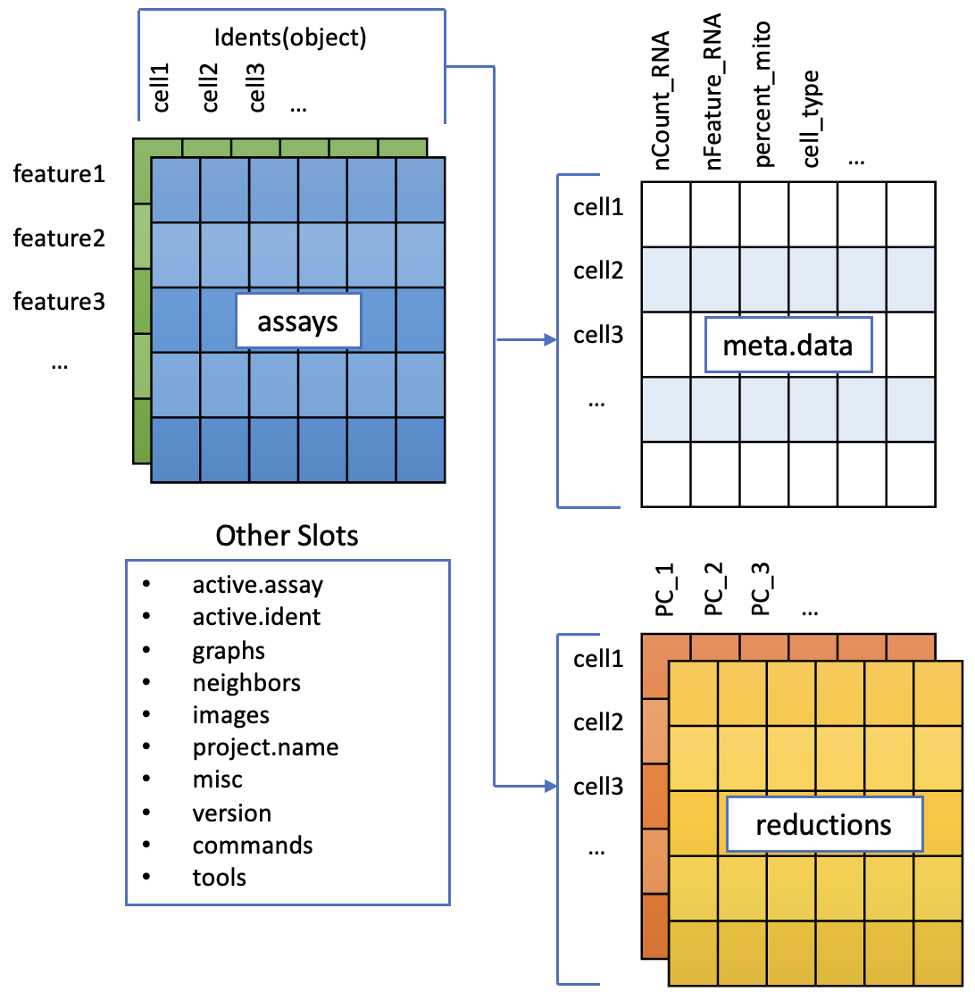

--- 
title: "scRNAseq Analysis in R with Seurat"
author: 'Monash Genomics and Bioinformatics Platform (MGBP)'
date: 'Compiled: `r format(Sys.Date(), "%B %d, %Y")`'
site: bookdown::bookdown_site
documentclass: book
bibliography: [book.bib, packages.bib]
# url: your book url like https://bookdown.org/yihui/bookdown
# cover-image: path to the social sharing image like images/cover.jpg
description: |
  scRNAseq analysis in R with Seurat workshop material 
link-citations: yes
github-repo: https://github.com/MonashBioinformaticsPlatform/Nov2023_scRNAseq_workshop
---
```{r include=FALSE, cache=FALSE}
# example R options set globally
options(width = 60)

# example chunk options set globally
knitr::opts_chunk$set(
  comment = "#>",
  collapse = TRUE
  )
```
***

# Getting started

Instructors: [Adele Barugahare,](https://www.monash.edu/researchinfrastructure/bioinformatics/about/people) [Paul Harrison](https://www.monash.edu/researchinfrastructure/bioinformatics/about/people) & [Laura Perlaza-Jimenez](https://www.monash.edu/researchinfrastructure/bioinformatics/about/people)

## Summary

This workshop, conducted by the Monash Genomics and Bioinformatics Platform, will cover how to extend analysis to contemporary third-party tools, Seurat and SingleR. We will be walking through the Seurat 3K PBMC Dataset Tutorial and extend this to cell annotation using SingleR.   
Material for scRNAseq analysis in R with Seurat workshop.This workshop follows the introductory [Guided Clustering Tutorial](https://satijalab.org/seurat/articles/pbmc3k_tutorial.html) tutorial from Seurat.


Important links:

* [Installation and Setup instructions](set-up.html)
* [Slideshow introduction](../slides)
* [Challenge solutions](solutions.html) (no peeking!)


### Recommended Computer Requirements:

System Requirements:


*Windows:*

* Windows 8.1 (64-bit) or later
* 4GB RAM
* SSD storage highly recommended
* Updated video/display drivers recommended


*macOS:*

* macOS 10.15 (Catalina) or later
* 4GB RAM
* SSD storage highly recommended

Install latest versions of:

* R
* RStudio
* Seurat
* SeuratWrappers
* SingleR
* Celldex
* Harmony


```{r include=FALSE}
# automatically create a bib database for R packages
knitr::write_bib(c(
  .packages(), 
  'bookdown', 'knitr', 'rmarkdown'
  ), 'packages.bib')
```

<!--chapter:end:index.Rmd-->

```{r include=FALSE, cache=FALSE}
# example R options set globally
options(width = 60)

# example chunk options set globally
knitr::opts_chunk$set(
  comment = "#>",
  collapse = TRUE
  )
```
# Set up

For this workshop you will have available a VM. However, if you which to use your local computer here are the set up instructions:

**IMPORTANT: If you have an M1 Mac - Make sure you have [gfortan](https://mac.r-project.org/tools/).**

## Get the workshop material and data

In RStudio **create a new project**. This ensures all the files for this workshop are placed in their own folder.

Once you've created a new project, run the following R code

## Package Installation
 
For this workshop, several packages need to be installed.

BiocManager likes to update installed packages, but we have disabled this in the R code below. If your installation fails, then you might need to turn updates on. Note that if there are a large number of packages that BiocManager wants to update it can take several hours.

These instructions have been tested with R version 4.2.1 and Bioconductor version 3.16.

```{r eval=FALSE}
## Install required packages for Seurat:
install.packages(c("Seurat", "dplyr", "remotes", "R.utils","harmony"))

## Install required Bioconductor packages
install.packages("BiocManager")
BiocManager::install(c('SingleR', 'celldex',
                       'BiocGenerics', 'DelayedArray', 'DelayedMatrixStats',
                       'limma', 'S4Vectors', 'SingleCellExperiment',
                       'SummarizedExperiment','edgeR' ),
                     update=FALSE)


## install clustree
install.packages("clustree")
install.packages("RColorBrewer")
```

## Raw Data

```{r }
# where are you? what folder are you working in

getwd()

## Download and untar the data
options(timeout=3600)
download.file(
    "https://bioinformatics.erc.monash.edu/home/lper0012/SingleCellWorkshopData/data.tar","data.tar")

untar("data.tar")


```


<!--chapter:end:01-01-setup.Rmd-->

```{r include=FALSE, cache=FALSE}
# example R options set globally
options(width = 60)

# example chunk options set globally
knitr::opts_chunk$set(
  comment = "#>",
  collapse = TRUE
  )
```
# Schedule {#schedule}

| Time      | Content               |
| :---:|  :----: | 
|10:00	|	Zoom opened for participants|
||	Welcome and Housekeeping|
||	Background on ScRNAseq + R tools|
||	Seurat Object|
|11:15|	00:15	Breakout activity| 
| |	Load data|
|11:50|	00:10	Break|
||	QC filtering
|12:25|	00:10	Breakout activity|
||	QC filtering continued
|12:45|	00:10	Breakout activity|
||	Normalisation|
||	Lunch Break|
||	PCAs and UMAPs|
|14:50|	00:15	Breakout activity|
|	|Clustering|
|15:30|	00:15	Breakout activity|
|15:45|	00:10	Break|
||	Cluster Markers|
|	|	SingleR|
|16:25|	00:10	Break|
||Differential Expression|
||	Main room Discussion on differential expression|
|17:00|Final remarks and conclusion|


<!--chapter:end:02-schedual.Rmd-->

```{r include=FALSE, cache=FALSE}
# example R options set globally
options(width = 60)

# example chunk options set globally
knitr::opts_chunk$set(
  comment = "#>",
  collapse = TRUE
  )
```
# (PART) Seurat Object {-}  

# Structure {#structure}


Most of todays workshop will be following the Seurat PBMC tutorial (reproduced in the next section).
We'll load raw counts data, do some QC and setup various useful information in a Seurat object. 

But before that - what does a Seurat object look like, and what can we do with it once we've made one?

Lets have a look at a Seurat object that's already setup. 


## Load an existing Seurat object

The data we're working with today is a small dataset of about 3000 PBMCs (peripheral blood mononuclear cells) from a healthy donor. Just one sample.

This is an early demo dataset from 10X genomics (called pbmc3k) - you can find more information like qc reports [here](https://www.10xgenomics.com/resources/datasets/3-k-pbm-cs-from-a-healthy-donor-1-standard-1-1-0).


First, load Seurat package.
```{r libloader, results='hide', message=FALSE, warning=FALSE} 
library(Seurat)
```


And here's the one we prepared earlier. Seurat objects are usually saved as '.rds' files, which is an R format for storing binary data (not-text or human-readable). The functions `readRDS()` can load it.

```{r}
pbmc_processed <- readRDS("data/pbmc_tutorial.rds")
pbmc_processed
```

#### Discussion: The Seurat Object in R { - .rational}

Lets take a look at the seurat object we have just created in R, `pbmc_processed`

To accomodate the complexity of data arising from a single cell RNA seq experiment, the seurat object keeps this as a container of multiple data tables that are linked.

{width=80%}


The functions in seurat can access parts of the data object for analysis and visualisation, we will cover this later on. 

There are a couple of concepts to discuss here.
<details>
<summary>**Class**</summary>

These are essentially data containers in R as a class, and can accessed as a variable in the R environment. 

Classes are pre-defined and can contain multiple data tables and metadata. For Seurat, there are three types. 

* Seurat - the main data class, contains all the data.
* Assay - found within the Seurat object. Depending on the experiment a cell could have data on RNA, ATAC etc measured
* DimReduc - for PCA and UMAP

</details>

<details>
<summary>**Slots**</summary>

Slots are parts within a class that contain specific data. These can be lists, data tables and vectors and can be accessed with conventional R methods.
 
</details>


<details>
<summary>**Data Access**</summary>

Many of the functions in Seurat operate on the data class and slots within them seamlessly. There maybe occasion to access these separately to `hack` them, however this is an advanced analysis method. 

The ways to access the slots can be through methods for the class (functions) or with standard R accessor nomenclature.
</details>

**Examples of accessing a Seurat object**

The `assays` slot in `pbmc_processed` can be accessed with `pbmc_processed@assays`.

The `RNA` assay can be accessed from this with `pbmc_processed@assays$RNA`. 

We often want to access assays, so Seurat nicely gives us a shortcut `pbmc_processed$RNA`. You may sometimes see an alternative notation `pbmc_processed[["RNA"]]`.

In general, slots that are always in an object are accessed with `@` and things that may be different in different data sets are accessed with `$`.

**Have a go**

Use `str` to look at the structure of the Seurat object `pbmc_processed`.

What is in the `meta.data` slot within your Seurat object currently? What type of data is contained here?

Where is our count data within the Seurat object? 


## What's in there?

Some of the most important information for working with Seurat objects is in the metadata.
This is cell level information - each row is one cell, identified by its barcode. 
Extra information gets added to this table as analysis progresses.

```{r}
head(pbmc_processed@meta.data)
```


That doesn't have any gene expression though, that's stored in an 'Assay'. 
The Assay structure has some nuances (see discussion below), but there are functions that get the assay data out for you. 

By default this object will return the normalised data (from the only assay in this object, called RNA). Every '.' is a zero.

```{r}
GetAssayData(pbmc_processed)[1:15,1:2]
```


But the raw counts data is accessible too.
```{r}
GetAssayData(pbmc_processed, slot='counts')[1:15,1:2]
```


<!--chapter:end:04-01-seuratobject.Rmd-->

```{r include=FALSE, cache=FALSE}
# example R options set globally
options(width = 60)

# example chunk options set globally
knitr::opts_chunk$set(
  comment = "#>",
  collapse = TRUE
  )
```
# Load data {#load}


This workshop follows the introductory [Guided Clustering Tutorial](https://satijalab.org/seurat/articles/pbmc3k_tutorial.html) tutorial from Seurat. 

The bulk of this workshop may be found in its original format there.


## Setup the Seurat Object

For this tutorial, we will be analyzing the a dataset of Peripheral Blood Mononuclear Cells (PBMC) freely available from 10X Genomics. There are 2,700 single cells that were sequenced on the Illumina NextSeq 500. The raw data can be found [here](https://cf.10xgenomics.com/samples/cell/pbmc3k/pbmc3k_filtered_gene_bc_matrices.tar.gz).

We start by reading in the data. The `Read10X()` function reads in the output of the [cellranger](https://support.10xgenomics.com/single-cell-gene-expression/software/pipelines/latest/what-is-cell-ranger) pipeline from 10X, returning a unique molecular identified (UMI) count matrix. The values in this matrix represent the number of molecules for each feature (i.e. gene; row) that are detected in each cell (column).


#### Note: What does the data look like? { - .challenge}

What do the input files look like? It varies, but this is the output of the CellRanger pipleine, described [here](https://support.10xgenomics.com/single-cell-gene-expression/software/pipelines/latest/output/gex-outputs)

```
├── analysis
│   ├── clustering
│   ├── diffexp
│   ├── pca
│   ├── tsne
│   └── umap
├── cloupe.cloupe
├── filtered_feature_bc_matrix
│   ├── barcodes.tsv.gz
│   ├── features.tsv.gz
│   └── matrix.mtx.gz
├── filtered_feature_bc_matrix.h5
├── metrics_summary.csv
├── molecule_info.h5
├── possorted_genome_bam.bam
├── possorted_genome_bam.bam.bai
├── raw_feature_bc_matrix
│   ├── barcodes.tsv.gz
│   ├── features.tsv.gz
│   └── matrix.mtx.gz
├── raw_feature_bc_matrix.h5
└── web_summary.html
```

### { - }


We next use the count matrix to create a `Seurat` object. The object serves as a container that contains both data (like the count matrix) and analysis (like PCA, or clustering results) for a single-cell dataset. For a technical discussion of the `Seurat` object structure, check out the [GitHub Wiki](https://github.com/satijalab/seurat/wiki). For example, the count matrix is stored in `pbmc@assays$RNA@counts`.

```{r libloader2, results='hide', message=FALSE, warning=FALSE} 
library(dplyr)
library(ggplot2)
library(Seurat)
library(patchwork)
```

```{r init, warning=FALSE}
# Load the PBMC dataset
pbmc.data <- Read10X(data.dir = "data/pbmc3k/filtered_gene_bc_matrices/hg19/")
# Initialize the Seurat object with the raw (non-normalized data).
pbmc <- CreateSeuratObject(counts = pbmc.data, project = "pbmc3k", min.cells = 3, min.features = 200)
pbmc
```

<details>
  <summary>**What does data in a count matrix look like?**</summary>

```{r, warning=FALSE}
# Lets examine a few genes in the first thirty cells
pbmc.data[c("CD3D","TCL1A","MS4A1"), 1:30]
```

The `.` values in the matrix represent 0s (no molecules detected). Since most values in an scRNA-seq matrix are 0,  Seurat uses a sparse-matrix representation whenever possible. This results in significant memory and speed savings for Drop-seq/inDrop/10x data.

```{r}
dense.size <- object.size(as.matrix(pbmc.data))
dense.size
sparse.size <- object.size(pbmc.data)
sparse.size
dense.size / sparse.size
```

</details>


<!--chapter:end:04-02-load.Rmd-->

```{r include=FALSE, cache=FALSE}
# example R options set globally
options(width = 60)

# example chunk options set globally
knitr::opts_chunk$set(
  comment = "#>",
  collapse = TRUE
  )
```
# (PART) Single Cell Analysis {-}  


# QC Filtering {#qc}


<!-- Discuss counts per cell/gene and make plots -->
<!-- Discuss that there's no one threshold -->
<!-- everyone pick a threshold and go filter -->
<!-- check numbers of cells. -->
<!-- save your object -->
<!-- (other qc metrics = Mt gene content, cell cycle asignment, low seq diversity e.t.c) -->


The steps below encompass the standard pre-processing workflow for scRNA-seq data in Seurat. These represent the selection and filtration of cells based on QC metrics, data normalization and scaling, and the detection of highly variable features.

## QC and selecting cells for further analysis

#### Why do we need to do this? {- .rational}
Low quality cells can add noise to your results leading you to the wrong biological conclusions. Using only good quality cells helps you to avoid this. Reduce noise in the data by filtering out low quality cells such as dying or stressed cells (high mitochondrial expression) and cells with few features that can reflect empty droplets.

####  {-}


Seurat allows you to easily explore QC metrics and filter cells based on any user-defined criteria. A few QC metrics [commonly used](https://www.ncbi.nlm.nih.gov/pmc/articles/PMC4758103/) by the community include

* The number of unique genes detected in each cell. 
    + Low-quality cells or empty droplets will often have very few genes
    + Cell doublets or multiplets may exhibit an aberrantly high gene count
* Similarly, the total number of molecules detected within a cell (correlates strongly with unique genes)
* The percentage of reads that map to the mitochondrial genome
    + Low-quality / dying cells often exhibit extensive mitochondrial contamination
    + We calculate mitochondrial QC metrics with the `PercentageFeatureSet()` function, which calculates the percentage of counts originating from a set of features
    + We use the set of all genes starting with `MT-` as a set of mitochondrial genes

```{r mito, fig.height=7, fig.width=13}
# The $ operator can add columns to object metadata. 
# This is a great place to stash QC stats
pbmc$percent.mt <- PercentageFeatureSet(pbmc, pattern = "^MT-")
```

  

#### Challenge: The meta.data slot in the Seurat object { - .challenge}

Where are QC metrics stored in Seurat?

* The number of unique genes and total molecules are automatically calculated during `CreateSeuratObject()`
    + You can find them stored in the object meta data

1. What do you notice has changed within the `meta.data` table now that we have calculated mitochondrial gene proportion?

2. Imagine that this is the first of 
several samples in our experiment. Add a `samplename` column to to the `meta.data` table.

####  {-}


In the example below, we visualize QC metrics, and use these to filter cells.

* We filter cells that have unique feature counts over 2,500 or less than 200
* We filter cells that have >5% mitochondrial counts
    
```{r qc2}
#Visualize QC metrics as a violin plot
VlnPlot(pbmc, features = c("nFeature_RNA", "nCount_RNA", "percent.mt"), ncol = 3)


# visualize the max and min 
VlnPlot(pbmc, features = "nFeature_RNA")+ scale_y_continuous(limits = c(1000,3000))
VlnPlot(pbmc, features = "nFeature_RNA",y.max =1000)


# FeatureScatter is typically used to visualize feature-feature relationships, 
# but can be used for anything calculated by the object, 
# i.e. columns in object metadata, PC scores etc.
plot1 <- FeatureScatter(pbmc, feature1 = "nCount_RNA", feature2 = "percent.mt") 
plot2 <- FeatureScatter(pbmc, feature1 = "nCount_RNA", feature2 = "nFeature_RNA") 
plot1 + plot2
```

Lets look at the number of features (genes) to the percent mitochondrial genes plot.

```{r}
plot3 <- FeatureScatter(pbmc, feature1 = "nFeature_RNA", feature2 = "percent.mt") 
plot3
```


<!-- #### Challenge: Ribosomal gene expression as a QC metric {- .challenge} -->
<!-- Ribosomal gene expression could be another factor to look into your cells within your experiment. -->

<!-- Create more columns of metadata using `PercentageFeatureSet` function, this time search for ribosomal genes. We can  calculate the percentage for the large subunit (RPL) and small subunit (RPS) ribosomal genes.  -->

<!-- Use `FeatureScatter` to plot combinations of metrics available in metadata. How is the mitochondrial gene percentage related to the ribosomal gene percentage? What can you see? Discuss in break out. -->

<!-- <details> -->
<!-- <summary>**Code for challenge**</summary> -->
<!-- Create new meta.data columns to contain percentages of the large and small ribosomal genes. -->

<!-- Then plot a scatter plot with this new data. You should find that the large and small ribosomal subunit genes are correlated within cell.  -->

<!-- What about with mitochondria and gene, feature counts? -->

<!-- These are the cells you may want to exclude. -->
<!-- </details> -->

<!-- <details> -->
<!-- <summary>**Advanced Challenge**</summary> -->
<!-- Highlight cells with very low percentage of ribosomal genes, create a new column in the meta.data table and with `FeatureScatter` make a plot of the RNA count and mitochondrial percentage with the cells with very low ribosomal gene perentage. -->
<!-- </details> -->
<!-- ### { - } --> 
you can check different thresholds of mito percentage

```{r}
#Number of cells left after filters
# percentage of cell with less than 10% mito
round(sum(pbmc$percent.mt < 10)/dim(pbmc)[2]*100,2) 

# percentage of cell with less than 20% mito
round((sum(pbmc$percent.mt < 20)/dim(pbmc)[2])*100,2)

# percentage of cell with less than 30% mito
round((sum(pbmc$percent.mt < 30)/dim(pbmc)[2])*100,2) 


```

Okay we are happy with our thresholds for mitochondrial percentage in cells, lets apply them and subset our data. This will remove the cells we think are of poor quality. 

```{r}
pbmc <- subset(pbmc, subset = nFeature_RNA > 200 & nFeature_RNA < 2500 & percent.mt < 5)
```


Lets replot the feature scatters and see what they look like. 

```{r qc2_sidebar, fig.height=7, fig.width=13}
plot5 <- FeatureScatter(pbmc, feature1 = "nCount_RNA", feature2 = "percent.mt") 
plot6 <- FeatureScatter(pbmc, feature1 = "nCount_RNA", feature2 = "nFeature_RNA") 
plot5 + plot6
```

#### Challenge: Filter the cells {- .challenge}

Apply the filtering thresolds defined above. 

* How many cells survived filtering?

The PBMC3k dataset we're working with in this tutorial is quite old. There are a number of other example datasets available from the 10X website, including [this one](https://www.10xgenomics.com/resources/datasets/10k-human-pbmcs-3-v3-1-chromium-x-with-intronic-reads-3-1-high) - published in 2022, sequencing 10k PBMCs with a newer chemistry and counting method.
 
* What thresholds would you chose to apply to this modern dataset?

```{r eval=FALSE}
pbmc10k_unfiltered <- readRDS("data/10k_PBMC_v3.1ChromiumX_Intronic.rds")
VlnPlot(pbmc10k_unfiltered, features = c("nFeature_RNA", "nCount_RNA"), ncol = 2)
```


<!--chapter:end:04-03-qc.Rmd-->

```{r include=FALSE, cache=FALSE}
# example R options set globally
options(width = 60)

# example chunk options set globally
knitr::opts_chunk$set(
  comment = "#>",
  collapse = TRUE
  )
```
# Normalisation {#norm}


#### Why do we need to do this? {- .rational}
The sequencing depth can be different per cell. This can bias the counts of expression showing higher numbers for more sequenced cells leading to the wrong biological conclusions. To correct this the feature counts are normalized.
                              
####  {-}


After removing unwanted cells from the dataset, the next step is to normalize the data. By default, we employ a global-scaling normalization method "LogNormalize" that normalizes the feature expression measurements for each cell by the total expression, multiplies this by a scale factor (10,000 by default), and log-transforms the result. Normalized values are stored in `pbmc$RNA@data`.

```{r normalize}
pbmc <- NormalizeData(pbmc, normalization.method = "LogNormalize", scale.factor = 1e4)
```
For clarity, in this previous line of code (and in future commands), we provide the default values for certain parameters in the function call. However, this isn't required and the same behavior can be achieved with:

```{r normalize.default, eval = FALSE}
pbmc <- NormalizeData(pbmc)
```


<!--chapter:end:04-04-norm.Rmd-->

```{r include=FALSE, cache=FALSE}
# example R options set globally
options(width = 60)

# example chunk options set globally
knitr::opts_chunk$set(
  comment = "#>",
  collapse = TRUE
  )
```
# PCAs and UMAPs {#reducedims}

<!-- why pca -->
<!-- how to pick genes for pca -->
<!-- why not pca? the blob of not very usefulness. -->
<!-- Elbow plots -->
<!-- oooh umap. -->


## Identification of highly variable features (feature selection)

#### Why do we need to do this? {- .rational}
Identifying the most variable features allows retaining the real biological variability of the data and reduce noise in the data.                            

####  {-}

We next calculate a subset of features that exhibit high cell-to-cell variation in the dataset (i.e, they are highly expressed in some cells, and lowly expressed in others). We and [others](https://www.nature.com/articles/nmeth.2645) have found that focusing on these genes in downstream analysis helps to highlight biological signal in single-cell datasets.

Our procedure in Seurat is described in detail [here](https://doi.org/10.1016/j.cell.2019.05.031), and improves on previous versions by directly modeling the mean-variance relationship inherent in single-cell data, and is implemented in the `FindVariableFeatures()` function. By default, we return 2,000 features per dataset. These will be used in downstream analysis, like PCA.

```{r var_features, fig.height=5, fig.width=11}
pbmc <- FindVariableFeatures(pbmc, selection.method = 'vst', nfeatures = 2000)
# Identify the 10 most highly variable genes
top10 <- head(VariableFeatures(pbmc), 10)
# plot variable features with and without labels
plot1 <- VariableFeaturePlot(pbmc)
plot2 <- LabelPoints(plot = plot1, points = top10, repel = TRUE)
plot1 + plot2
```

<!-- #### Challenge: Labelling Genes of Interest {- .challenge} -->

<!-- What if we wanted to look at genes we are specifically interested in? We can create a character vector of gene names and apply that to this plot. -->

<!-- Make a plot with labels for the genes IL8, IDH2 and CXCL3. -->


## Scaling the data

#### Why do we need to do this? {- .rational}

Highly expresed genes can overpower the signal of other less expresed genes with equal importance. Within the same cell the assumption is that the underlying RNA content is constant. Aditionally, If variables are provided in vars.to.regress, they are individually regressed against each feature, and the resulting residuals are then scaled and centered.
This step allows controling for cell cycle and other factors that may bias your clustering.


####  {-}


Next, we apply a linear transformation ('scaling') that is a standard pre-processing step prior to dimensional reduction techniques like PCA. The `ScaleData()` function:

* Shifts the expression of each gene, so that the mean expression across cells is 0
* Scales the expression of each gene, so that the variance across cells is 1
    + This step gives equal weight in downstream analyses, so that highly-expressed genes do not dominate
* The results of this are stored in `pbmc$RNA@scale.data`

```{r regress, fig.height=7, fig.width=11, results='hide'}
all.genes <- rownames(pbmc)
pbmc <- ScaleData(pbmc, features = all.genes)
```
<details>
  <summary>**This step takes too long! Can I make it faster?**</summary>

Scaling is an essential step in the Seurat workflow, but only on genes that will be used as input to PCA. Therefore, the default in `ScaleData()` is only to perform scaling on the previously identified variable features (2,000 by default). To do this, omit the `features` argument in the previous function call, i.e.
```{r regressvar, fig.height=7, fig.width=11, results='hide',eval = FALSE}
# pbmc <- ScaleData(pbmc)
```
Your PCA and clustering results will be unaffected. However, Seurat heatmaps (produced as shown below with `DoHeatmap()`) require genes in the heatmap to be scaled, to make sure highly-expressed genes don't dominate the heatmap. To make sure we don't leave any genes out of the heatmap later, we are scaling all genes in this tutorial. 
</details>
\  
<details>
  <summary>**How can I remove unwanted sources of variation, as in Seurat v2?**</summary>

In `Seurat v2` we also use the `ScaleData()` function to remove unwanted sources of variation from a single-cell dataset. For example, we could 'regress out' heterogeneity associated with (for example) cell cycle stage, or mitochondrial contamination. These features are still supported in `ScaleData()` in `Seurat v3`, i.e.: 
```{r regressvarmt, fig.height=7, fig.width=11, results='hide',eval = FALSE}
# pbmc <- ScaleData(pbmc, vars.to.regress = 'percent.mt')
```
However, particularly for advanced users who would like to use this functionality, we strongly recommend the use of our new normalization workflow, `SCTransform()`. The method is described in our [paper](https://genomebiology.biomedcentral.com/articles/10.1186/s13059-019-1874-1), with a separate vignette using Seurat v3 [here](sctransform_vignette.html). As with `ScaleData()`, the function `SCTransform()` also includes a `vars.to.regress` parameter.
</details>
\ 

***


# Dimensionality reduction

#### Why do we need to do this? {- .rational}

Imagine each gene represents a dimension - or an axis on a plot. We could plot the expression of two genes with a simple scatterplot. But a genome has thousands of genes - how do you collate all the information from each of those genes in a way that allows you to visualise it in a 2 dimensional image. This is where dimensionality reduction comes in, we calculate meta-features that contains combinations of the variation of different genes. From thousands of genes, we end up with 10s of meta-features

####  {-}                    


## Perform linear dimensional reduction

Next we perform PCA on the scaled data. By default, only the previously determined variable features are used as input, but can be defined using `features` argument if you wish to choose a different subset.

```{r pca,results='hide'}
pbmc <- RunPCA(pbmc, features = VariableFeatures(object = pbmc))
```

Seurat provides several useful ways of visualizing both cells and features that define the PCA, including `VizDimReduction()`, `DimPlot()`, and `DimHeatmap()`

```{r pca_viz, message=TRUE}
# Examine and visualize PCA results a few different ways
print(pbmc$pca, dims = 1:5, nfeatures = 5)
VizDimLoadings(pbmc, dims = 1:2, reduction = 'pca')
DimPlot(pbmc, reduction = 'pca')
```

In particular `DimHeatmap()` allows for easy exploration of the primary sources of heterogeneity in a dataset, and can be useful when trying to decide which PCs to include for further downstream analyses. Both cells and features are ordered according to their PCA scores. Setting `cells` to a number plots the 'extreme' cells on both ends of the spectrum, which dramatically speeds plotting for large datasets. Though clearly a supervised analysis, we find this to be a valuable tool for exploring correlated feature sets.

```{r single-heatmap}
DimHeatmap(pbmc, dims = 1, cells = 500, balanced = TRUE)
```

```{r multi-heatmap, fig.height=15, fig.width=9}
DimHeatmap(pbmc, dims = 1:15, cells = 500, balanced = TRUE)
```


## Determine the 'dimensionality' of the dataset

To overcome the extensive technical noise in any single feature for scRNA-seq data, Seurat clusters cells based on their PCA scores, with each PC essentially representing a 'metafeature' that combines information across a correlated feature set. The top principal components therefore represent a robust compression of the dataset. However, how many components should we choose to include? 10? 20? 100?

-----

*Note*: The Seurat developers suggest using a JackStraw resampling test to determine this. See [Macosko *et  al*](http://www.cell.com/abstract/S0092-8674(15)00549-8), and the original [pbmc3 vignette](https://satijalab.org/seurat/articles/pbmc3k_tutorial.html#determine-the-dimensionality-of-the-dataset-1). We're going to use an Elbow Plot instead here, because its much quicker.

-----

An alternative heuristic method generates an 'Elbow plot': a ranking of principle components based on the percentage of variance explained by each one (`ElbowPlot()` function). In this example, we can observe an 'elbow' around PC9-10, suggesting that the majority of true signal is captured in the first 10 PCs. 

```{r elbow_plot}
ElbowPlot(pbmc)
```

Identifying the true dimensionality of a dataset -- can be challenging/uncertain for the user. We therefore suggest these three approaches to consider. The first is more supervised, exploring PCs to determine relevant sources of heterogeneity, and could be used in conjunction with GSEA for example. The second implements a statistical test based on a random null model, but is time-consuming for large datasets, and may not return a clear PC cutoff. The third is a heuristic that is commonly used, and can be calculated instantly. In this example, all three approaches yielded similar results, but we might have been justified in choosing anything between PC 7-12 as a cutoff. 

We chose 10 here, but encourage users to consider the following:

* Dendritic cell and NK aficionados may recognize that genes strongly associated with PCs 12 and 13 define rare immune subsets (i.e. MZB1 is a marker for plasmacytoid DCs). However, these groups are so rare, they are difficult to distinguish from background noise for a dataset of this size without prior knowledge. 
* We encourage users to repeat downstream analyses with a different number of PCs (10, 15, or even 50!). As you will observe, the results often do not differ dramatically.
* We advise users to err on the higher side when choosing this parameter. For example, performing downstream analyses with only 5 PCs does significantly and adversely affect results.

***


## Run non-linear dimensional reduction (UMAP/tSNE)

Seurat offers several non-linear dimensional reduction techniques, such as tSNE and UMAP, to visualize and explore these datasets. The goal of these algorithms is to learn the underlying manifold of the data in order to place similar cells together in low-dimensional space. Cells within the graph-based clusters determined above should co-localize on these dimension reduction plots. As input to the UMAP and tSNE, we suggest using the same PCs as input to the clustering analysis.

```{r tsne, fig.height=5, fig.width=7}
# If you haven't installed UMAP, you can do so via reticulate::py_install(packages = "umap-learn")
pbmc <- RunUMAP(pbmc, dims = 1:10)
```

```{r tsneplot, fig.height=5, fig.width=7}
# note that you can set `label = TRUE` or use the LabelClusters function to help label individual clusters
DimPlot(pbmc, reduction = 'umap')
```


#### Challenge: PC genes { - .challenge}

You can plot gene expression on the UMAP with the `FeaturePlot()` function. 

Try out some genes that were highly weighted in the principal component analysis. How do they look?


####  {-}


## Save 

You can save the object at this point so that it can easily be loaded back in without having to rerun the computationally intensive steps performed above, or easily shared with collaborators.

```{r saveobject, eval=FALSE}
saveRDS(pbmc, file = "pbmc_tutorial_saved.rds") 
```


<!--chapter:end:04-05-reducedims.Rmd-->

```{r include=FALSE, cache=FALSE}
# example R options set globally
options(width = 60)

# example chunk options set globally
knitr::opts_chunk$set(
  comment = "#>",
  collapse = TRUE
  )
```
# Clustering {#clustering}

#### Why do we need to do this?  {- .rational}

Clustering the cells will allow you to visualise the variability of your data, can help to segregate cells into cell types.   

####  {-}

## Cluster cells

<!-- Do clustering -->
<!-- Choose a resolution -->
<!-- What are the clusters? -->
<!-- Find cluster markers -->
<!-- Name some. -->

Seurat v3 applies a graph-based clustering approach, building upon initial strategies in ([Macosko *et al*](http://www.cell.com/abstract/S0092-8674(15)00549-8)). Importantly, the *distance metric* which drives the clustering analysis (based on previously identified PCs) remains the same. However, our approach to partitioning the cellular distance matrix into clusters has dramatically improved. Our approach was heavily inspired by recent manuscripts which applied graph-based clustering approaches to scRNA-seq data [[SNN-Cliq, Xu and Su, Bioinformatics, 2015]](http://bioinformatics.oxfordjournals.org/content/early/2015/02/10/bioinformatics.btv088.abstract) and CyTOF data [[PhenoGraph, Levine *et al*., Cell, 2015]](http://www.ncbi.nlm.nih.gov/pubmed/26095251). Briefly, these methods embed cells in a graph structure - for example a K-nearest neighbor (KNN) graph, with edges drawn between cells with similar feature expression patterns, and then attempt to partition this graph into highly interconnected 'quasi-cliques' or 'communities'. 

As in PhenoGraph, we first construct a KNN graph based on the euclidean distance in PCA space, and refine the edge weights between any two cells based on the shared overlap in their local neighborhoods (Jaccard similarity). This step is performed using the `FindNeighbors()` function, and takes as input the previously defined dimensionality of the dataset (first 10 PCs).

To cluster the cells, we next apply modularity optimization techniques such as the Louvain algorithm (default) or SLM [[SLM, Blondel *et al*., Journal of Statistical Mechanics]](http://dx.doi.org/10.1088/1742-5468/2008/10/P10008), to iteratively group cells together, with the goal of optimizing the standard modularity function. The `FindClusters()` function implements this procedure, and contains a resolution parameter that sets the 'granularity' of the downstream clustering, with increased values leading to a greater number of clusters. We find that setting this parameter between 0.4-1.2 typically returns good results for single-cell datasets of around 3K cells. Optimal resolution often increases for larger datasets. The clusters can be found using the `Idents()` function.


```{r cluster, fig.height=5, fig.width=7}
pbmc <- FindNeighbors(pbmc, dims = 1:10)
pbmc <- FindClusters(pbmc, resolution = 0.5)
# Look at cluster IDs of the first 5 cells
head(Idents(pbmc), 5)
```


Check out the clusters.
```{r}
DimPlot(pbmc)
# Equivalent to
# DimPlot(pbmc,reduction="umap", group.by="seurat_clusters")
# DimPlot(pbmc,reduction="umap", group.by="RNA_snn_res.0.5")
```

***


#### Challenge: Try different cluster settings {- .challenge}

Run `FindNeighbours` and `FindClusters` again, with a different number of dimensions or with a different resolution. Examine the resulting clusters using `DimPlot`.

To maintain the flow of this tutorial, please put the output of this exploration in a different variable, such as `pbmc2`!


####  {-}


## Choosing a cluster resolution


Its a good idea to try different resolutions when clustering to identify the varibility of your data. 

```{r}
resolution = 2
pbmc <- FindClusters(object = pbmc, reduction = "umap", resolution = seq(0.1, resolution, 0.1),
    dims = 1:10)

# the different clustering created
names(pbmc@meta.data)

# Look at cluster IDs of the first 5 cells
head(Idents(pbmc), 5)
```

Plot a clustree to decide how many clusters you have and what resolution capture them.

```{r fig.height=12}
library(clustree)
clustree(pbmc, prefix = "RNA_snn_res.") + theme(legend.key.size = unit(0.05, "cm"))
```

Name cells with the corresponding cluster name at the resolution you pick. This case we are happy with 0.5.
```{r}
# The name of the cluster is prefixed with 'RNA_snn_res' and the number of the resolution
Idents(pbmc) <- pbmc$RNA_snn_res.0.5
```

Plot the UMAP with colored clusters with Dimplot

```{r}
DimPlot(pbmc, label = TRUE, repel = TRUE, label.box = TRUE) + NoLegend()
```

<!--chapter:end:04-06-clustering.Rmd-->

```{r include=FALSE, cache=FALSE}
# example R options set globally
options(width = 60)

# example chunk options set globally
knitr::opts_chunk$set(
  comment = "#>",
  collapse = TRUE
  )
```
# Cluster Markers {#clustermarkers}

#### Why do we need to do this?  {- .rational}

Single cell data helps to segragate cell types. Use markers to identify cell types. warning: In this example the cell types/markers are well known and making this step easy, but in reality this step needs the experts curation.


####  {-}


## Finding differentially expressed features (cluster biomarkers)

Seurat can help you find markers that define clusters via differential expression. By default, it identifies positive and negative markers of a single cluster (specified in `ident.1`), compared to all other cells.  `FindAllMarkers()` automates this process for all clusters, but you can also test groups of clusters vs. each other, or against all cells.

The `min.pct` argument requires a feature to be detected at a minimum percentage in either of the two groups of cells, and the thresh.test argument requires a feature to be differentially expressed (on average) by some amount between the two groups. You can set both of these to 0, but with a dramatic increase in time - since this will test a large number of features that are unlikely to be highly discriminatory. As another option to speed up these computations, `max.cells.per.ident` can be set. This will downsample each identity class to have no more cells than whatever this is set to. While there is generally going to be a loss in power, the speed increases can be significant and the most highly differentially expressed features will likely still rise to the top.

```{r markers1, fig.height=8, fig.width=15}
# find all markers of cluster 2
cluster2.markers <- FindMarkers(pbmc, ident.1 = 2, min.pct = 0.25)
head(cluster2.markers, n = 5)
# find all markers distinguishing cluster 5 from clusters 0 and 3
cluster5.markers <- FindMarkers(pbmc, ident.1 = 5, ident.2 = c(0, 3), min.pct = 0.25)
head(cluster5.markers, n = 5)
# find markers for every cluster compared to all remaining cells, report only the positive ones
pbmc.markers <- FindAllMarkers(pbmc, only.pos = TRUE, min.pct = 0.25, logfc.threshold = 0.25)
pbmc.markers %>% group_by(cluster) %>% slice_max(n = 2, order_by = avg_log2FC)
```

Seurat has several tests for differential expression which can be set with the test.use parameter (see our [DE vignette](de_vignette.html) for details). For example, the ROC test returns the 'classification power' `abs(AUC-0.5)*2` for any individual marker, ranging from 0 = random to 1 = perfect.

```{r markersroc, fig.height=8, fig.width=15}
cluster0.markers <- FindMarkers(pbmc, ident.1 = 0, logfc.threshold = 0.25, test.use = "roc", only.pos = TRUE)
```

We include several tools for visualizing marker expression. `VlnPlot()` (shows expression probability distributions across clusters), and `FeaturePlot()` (visualizes feature expression on a tSNE or PCA plot) are our most commonly used visualizations. We also suggest exploring `RidgePlot()`, `CellScatter()`, and `DotPlot()` as additional methods to view your dataset.

```{r}
VlnPlot(pbmc, features = c("MS4A1", "CD79A"))
# you can plot raw counts as well
VlnPlot(pbmc, features = c("NKG7", "PF4"), slot = 'counts', log = TRUE)
```

```{r markerplots}
FeaturePlot(pbmc, features = c("MS4A1", "GNLY", "CD3E", "CD14", "FCER1A"))
FeaturePlot(pbmc, features = c("FCGR3A", "LYZ", "PPBP", "CD8A"))
```

<details>
  <summary>**Other useful plots**</summary>
These are ridgeplots, cell scatter plots and dotplots. Replace `FeaturePlot` with the other functions.

```{r ridgeplots}
RidgePlot(pbmc, features = c("MS4A1", "GNLY", "CD3E", "CD14", "FCER1A"))
RidgePlot(pbmc, features = c("FCGR3A", "LYZ", "PPBP", "CD8A"))
```
For CellScatter plots, will need the cell id of the cells you want to look at. You can get this from the cell metadata (`pbmc@meta.data`).
```{r}
head( pbmc@meta.data )
CellScatter(pbmc, cell1 = "AAACATACAACCAC-1", cell2 = "AAACATTGAGCTAC-1")
```

DotPlots

```{r}
DotPlot(pbmc, features = c("MS4A1", "GNLY", "CD3E", "CD14", "FCER1A", "FCGR3A", "LYZ", "PPBP", "CD8A"))
```

</details>


`DoHeatmap()` generates an expression heatmap for given cells and features. In this case, we are plotting the top 10 markers (or all markers if less than 10) for each cluster.

```{r clusterHeatmap, fig.height=8, fig.width=15}
top10 <- pbmc.markers %>% group_by(cluster) %>% top_n(n = 10, wt = avg_log2FC)
DoHeatmap(pbmc, features = top10$gene) + NoLegend()
```


## Use makers to label or find a cluster


If you know markers for your cell types, use AddModuleScore to label them.

```{r}
genes_markers <- list(Naive_CD4_T = c("IL7R", "CCR7"))

pbmc <- AddModuleScore(object = pbmc, features = genes_markers, ctrl = 5, name = "Naive_CD4_T",
    search = TRUE)


# notice the name of the cluster has a 1 at the end
names(pbmc@meta.data)

# label that cell type
pbmc$cell_label = NA
pbmc$cell_label[pbmc$Naive_CD4_T1 > 1] = "Naive_CD4_T"
Idents(pbmc) = pbmc$cell_label

# plot
# Using a custom colour scale 
FeaturePlot(pbmc, features = "Naive_CD4_T1", label = TRUE, repel = TRUE, ) + scale_colour_gradientn(colours = c("lightblue","beige","red"))
```


## Assigning cell type identity to clusters

Fortunately in the case of this dataset, we can use canonical markers to easily match the unbiased clustering to known cell types:

Cluster ID | Markers       | Cell Type
-----------|---------------|----------
0          | IL7R, CCR7    | Naive CD4+ T 
1          | CD14, LYZ     | CD14+ Mono
2          | IL7R, S100A4  | Memory CD4+ 
3          | MS4A1         | B 
4          | CD8A          | CD8+ T 
5          | FCGR3A, MS4A7 | FCGR3A+ Mono
6          | GNLY, NKG7    | NK 
7          | FCER1A, CST3  | DC
8          | PPBP          | Platelet


```{r labelplot}
Idents(pbmc) <- pbmc$RNA_snn_res.0.5
new.cluster.ids <- c("Naive CD4 T", "CD14+ Mono", "Memory CD4 T", "B", "CD8 T", "FCGR3A+ Mono", "NK", "DC", "Platelet")
names(new.cluster.ids) <- levels(pbmc)
pbmc <- RenameIdents(pbmc, new.cluster.ids)
DimPlot(pbmc, reduction = 'umap', label = TRUE, pt.size = 0.5) + NoLegend()
```

```{r save.img, include=FALSE}
plot <- DimPlot(pbmc, reduction = "umap", label = TRUE, label.size = 4.5) + xlab("UMAP 1") + ylab("UMAP 2") + 
  theme(axis.title = element_text(size = 18), legend.text = element_text(size = 18)) + 
  guides(colour = guide_legend(override.aes = list(size = 10)))
ggsave(filename = "pbmc3k_umap.jpg", height = 7, width = 12, plot = plot, quality = 50)
```

```{r save.rds, eval=FALSE}
saveRDS(pbmc, file = "pbmc3k_final.rds")
```


<!--chapter:end:04-07-clustermarkers.Rmd-->

```{r include=FALSE, cache=FALSE}
# example R options set globally
options(width = 60)

# example chunk options set globally
knitr::opts_chunk$set(
  comment = "#>",
  collapse = TRUE
  )
```
# (PART) Futher Analysis {-} 


# SingleR {#singler}

```{r results='hide', message=FALSE, warning=FALSE}
#install.packages("BiocManager")
#BiocManager::install(c("SingleCellExperiment","SingleR","celldex"),ask=F)
library(SingleCellExperiment)
library(SingleR)
library(celldex)
```

In this workshop we have focused on the Seurat package.  However, there is another whole ecosystem of R packages for single cell analysis within Bioconductor.  We won't go into any detail on these packages in this workshop, but there is good material describing the object type online : [OSCA](https://robertamezquita.github.io/orchestratingSingleCellAnalysis/data-infrastructure.html).

For now, we'll just convert our Seurat object into an object called SingleCellExperiment.  Some popular packages from Bioconductor that work with this type are Slingshot, Scran, Scater.

```{r}
sce <- as.SingleCellExperiment(pbmc)
sce
```

We will now use a package called SingleR to label each cell.  SingleR uses a reference data set of cell types with expression data to infer the best label for each cell.  A convenient collection of cell type reference is in the `celldex` package which currently contains the follow sets:

```{r}
ls('package:celldex')
```
In this example, we'll use the `HumanPrimaryCellAtlasData` set, which contains high-level, and fine-grained label types. Lets download the reference dataset

```{r}
# This too is a sce object,
# colData is equivalent to seurat's metadata
ref.set <- celldex::HumanPrimaryCellAtlasData()
```

The "main" labels.
```{r}
unique(ref.set$label.main)
```

An example of the types of "fine" labels.

```{r}
head(unique(ref.set$label.fine))
```

Now we'll label our cells using the SingleCellExperiment object, with the above reference set.

```{r}
pred.cnts <- SingleR::SingleR(test = sce, ref = ref.set, labels = ref.set$label.main)
```

Keep any types that have more than 10 cells to the label, and put those labels back on our Seurat object and plot our on our umap.

<!-- previously this used first.lables, which no longer seems to exist in pred.cnts -->
<!-- labels and pruned labels are identical in this data --> 

```{r}
lbls.keep <- table(pred.cnts$labels)>10
pbmc$SingleR.labels <- ifelse(lbls.keep[pred.cnts$labels], pred.cnts$labels, 'Other')
DimPlot(pbmc, reduction='umap', group.by='SingleR.labels')
```

It is nice to see that even though SingleR does not use the clusters we computed earlier, the labels do seem to match those clusters reasonably well.


<!--chapter:end:04-08-singleR.Rmd-->

```{r include=FALSE, cache=FALSE}
# example R options set globally
options(width = 60)

# example chunk options set globally
knitr::opts_chunk$set(
  comment = "#>",
  collapse = TRUE
  )
```
# Differential Expression {#de2}


There are many different methods for calculating differential expression between groups in scRNAseq data. There are a number of review papers worth consulting on this topic.

There is the [Seurat differential expression Vignette](https://satijalab.org/seurat/archive/v3.1/de_vignette.html) which walks through the variety implemented in Seurat. 

There is also a good discussion of useing [pseudobulk approaches](http://bioconductor.org/books/3.15/OSCA.multisample/multi-sample-comparisons.html#creating-pseudo-bulk-samples) which is worth checking out if youre planning differential expression analyses.

---

We will now look at [GSE96583](https://www.ncbi.nlm.nih.gov/geo/query/acc.cgi?acc=GSE96583), another PBMC dataset. For speed, we will be looking at a subset of 5000 cells from this data. The cells in this dataset were pooled from eight individual donors. This data contains two batches of single cell sequencing. One of the batches was stimulated with IFN-beta.


The data has already been processed as we have done with the first PBMC dataset, and can be loaded from the `kang2018.rds` file in the data folder.

```{r }
kang <- readRDS("data/kang2018.rds")
head(kang@meta.data)
```

How cells from each condition do we have?
```{r}
table(kang$stim)
```

How many cells per individuals per group?
```{r}
table(kang$ind, kang$stim)
```
And for each sample, how many of each cell type has been classified?

```{r}
table(paste(kang$ind,kang$stim), kang$cell)
```


## Prefiltering

#### Why do we need to do this? {- .rational}

If expression is below a certain level, it will be almost impossible to see any differential expression.

#### {-}


When doing differential expression, you generally ignore genes with low expression.
In single cell datasets, there are many genes like this. Filtering here to make our dataset smaller so it runs quicker, and there is less aggressive correction for multiple hypotheses.

How many genes before filtering?
```{r}
kang
```


How many copies of each gene are there?
```{R}
total_per_gene <- rowSums(GetAssayData(kang, assay='RNA', slot='counts'))
hist(log10(total_per_gene))
```


Lets keep only those genes with at least 50 copies across the entire experiment.
```{r}
kang <- kang[total_per_gene >= 50, ] 
```


How many genes after filtering?
```{r}
kang
```


We might like to see the effect of IFN-beta stimulation on each cell type individually. For the purposes of this workshop, just going to test one cell type; CD14+ Monocytes 

An easy way is to subset the object. 

```{r}
# Set idents to 'cell' column.
Idents(kang) <- kang$cell
DimPlot(kang)
kang.celltype <- kang[, kang$cell == "CD14+ Monocytes" ]
DimPlot(kang.celltype)
```


##  Default Wilcox test

To run this test, we change the Idents to the factor(column) we want to test. In this case, that's 'stim'.

```{r}
# Change Ident to Condition
Idents(kang.celltype) <- kang.celltype$stim

# default, wilcox test
de_result_wilcox <- FindMarkers(kang.celltype, 
            ident.1 = 'stim',
            ident.2 = 'ctrl',
            logfc.threshold = 0, # Give me ALL results
            min.pct = 0
            )

# Add average expression for plotting
de_result_wilcox$AveExpr<- rowMeans(kang.celltype[["RNA"]]@data[rownames(de_result_wilcox),])
```

Look at the top differentially expressed genes.
```{r}
head(de_result_wilcox)
```

```{r}
p1 <- ggplot(de_result_wilcox, aes(x=AveExpr, y=avg_log2FC, col=p_val_adj < 0.05)) +
  geom_point() +
  scale_colour_manual(values=c('TRUE'="red",'FALSE'="black")) + 
  theme_bw() +
  ggtitle("Wilcox Test")


p2 <- ggplot(de_result_wilcox, aes(x=avg_log2FC, y=-log10(p_val), col=p_val_adj < 0.05)) +
  geom_point() +
  scale_colour_manual(values=c('TRUE'="red",'FALSE'="black")) + 
  theme_bw() +
  ggtitle("Wilcox Test (Volcano)")

p1 + p2
```


## Seurat Negative binomial

Negative binonial test is run almost the same way - just need to specify it under 'test.use'

```{r results='hide', warning=FALSE, message=FALSE}

# Change Ident to Condition
Idents(kang.celltype) <- kang.celltype$stim

# default, wilcox test
de_result_negbinom <- FindMarkers(kang.celltype, 
            test.use="negbinom", # Choose a different test.
            ident.1 = 'stim',
            ident.2 = 'ctrl',
            logfc.threshold = 0, # Give me ALL results
            min.pct = 0
)

# Add average expression for plotting
de_result_negbinom$AveExpr<- rowMeans(kang.celltype[["RNA"]]@data[rownames(de_result_negbinom),])
```


Look at the top differentially expressed genes.
```{r}
head(de_result_negbinom)
```

```{r}
p1 <- ggplot(de_result_negbinom, aes(x=AveExpr, y=avg_log2FC, col=p_val_adj < 0.05)) +
  geom_point() +
  scale_colour_manual(values=c('TRUE'="red",'FALSE'="black")) + 
  theme_bw() +
  ggtitle("Negative Bionomial Test")


p2 <- ggplot(de_result_negbinom, aes(x=avg_log2FC, y=-log10(p_val), col=p_val_adj < 0.05)) +
  geom_point() +
  scale_colour_manual(values=c('TRUE'="red",'FALSE'="black")) + 
  theme_bw() +
  ggtitle("Negative Bionomial Test (Volcano)")

p1 + p2
```


## Pseudobulk

Pseudobulk analysis is an option where you have biological replicates. It is essentially pooling the individual cell counts and treating your expreiment like a bulk RNAseq.


First, you need to build a pseudobulk matrix - the `AggregateExpression()` function can do this, once you set the 'Idents' of your seurat object to your grouping factor (here, thats a combination of individual+treatment called 'sample', instead of the 'stim' treatment column).

```{r}
# Tools for bulk differential expression
library(limma)
library(edgeR)


# Change idents to ind for grouping.
kang.celltype$sample <- factor(paste(kang.celltype$stim, kang.celltype$ind, sep="_"))
Idents(kang.celltype) <- kang.celltype$sample

# THen pool together counts in those groups
# AggregateExperssion returns a list of matricies - one for each assay requested (even just requesting one)
pseudobulk_matrix_list <- AggregateExpression( kang.celltype,  slot = 'counts', assays='RNA' )
pseudobulk_matrix      <- pseudobulk_matrix_list[['RNA']]
colnames(pseudobulk_matrix) <- as.character(colnames(pseudobulk_matrix)) # Changes colnames to simple text
pseudobulk_matrix[1:5,1:4]
```

Now it looks like a bulk RNAseq experiment, so treat it like one.

We can use the popular `limma` package for differential expression. Here is one [tutorial](https://ucdavis-bioinformatics-training.github.io/2018-June-RNA-Seq-Workshop/thursday/DE.html), and the hefty reference manual is hosted by [bioconductor](https://bioconductor.org/packages/release/bioc/html/limma.html).

In brief, this code below constructs a linear model for this experiment that accounts for the variation in individuals and treatment. It then tests for differential expression between 'stim' and 'ctrl' groups.

```{R}
dge <- DGEList(pseudobulk_matrix)
dge <- calcNormFactors(dge)

# Remove _ or - and everything after it - yeilds stim group
stim <- gsub("[-_].*","",colnames(pseudobulk_matrix)) 

# Removing everything before the _ or - for the individual, then converting those numerical ind explictiy to text. Else limma will treat them as numbers!
ind  <- as.character(gsub(".*[-_]","",colnames(pseudobulk_matrix))) 

design <- model.matrix( ~0 + stim + ind)
vm  <- voom(dge, design = design, plot = FALSE)
fit <- lmFit(vm, design = design)

contrasts <- makeContrasts(stimstim - stimctrl, levels=coef(fit))
fit <- contrasts.fit(fit, contrasts)
fit <- eBayes(fit)

de_result_pseudobulk <- topTable(fit, n = Inf, adjust.method = "BH")
de_result_pseudobulk <- arrange(de_result_pseudobulk , adj.P.Val)
```


Look at the significantly differentially expressed genes:
```{r}
head(de_result_pseudobulk)
```


```{r}
p1 <- ggplot(de_result_pseudobulk, aes(x=AveExpr, y=logFC, col=adj.P.Val < 0.05)) +
  geom_point() +
  scale_colour_manual(values=c('TRUE'="red",'FALSE'="black")) + 
  theme_bw() +
  ggtitle("Pseudobulk")


p2 <- ggplot(de_result_pseudobulk, aes(x=logFC, y=-log10(P.Value), col=adj.P.Val < 0.05)) +
  geom_point() +
  scale_colour_manual(values=c('TRUE'="red",'FALSE'="black")) + 
  theme_bw() +
  ggtitle("Pseudobulk Test (Volcano)")

p1 + p2

```

#### Discussion {- .challenge}

These methods give different results. How would you decide which to use? How could you check an individual gene?

#### {-}

<!--chapter:end:04-10-de2.Rmd-->

```{r include=FALSE, cache=FALSE}
# example R options set globally
options(width = 60)

# example chunk options set globally
knitr::opts_chunk$set(
  comment = "#>",
  collapse = TRUE
  )
```
# Cell cycle Assignment {#CellCycle}

In some datasets, the phase of cell cycle that a cell is in (G1/G2M/S) can account for 
alot of the observed transcriptomic variation. There may be clustering by phase, or 
separation in the UMAP by phase. 

Seurat provides a simple method for assigning cell cycle state to each cell. Other methods are available. 

More information about assigning cell cycle states to cells is in the [cell cycle vignette](https://satijalab.org/seurat/articles/cell_cycle_vignette.html)

```{r cc}
# A list of cell cycle markers, from Tirosh et al, 2015, is loaded with Seurat.  We can
# segregate this list into markers of G2/M phase and markers of S phase
s.genes   <- cc.genes$s.genes
g2m.genes <- cc.genes$g2m.genes

# Use those lists with the cell cycle scoring function in Seurat.
pbmc <- CellCycleScoring(pbmc, s.features = s.genes, g2m.features = g2m.genes)
```


Which adds S.Score, G2M.Score and Phase calls to the metadata.
```{r}
head(pbmc@meta.data)
```


We can then check the cell phase on the UMAP. In this dataset, phase isn't driving the clustering, and would not require any further handling. 

```{r}
DimPlot(pbmc, reduction = 'umap', group.by = "Phase")
```

Where a bias _is_ present, your course of action depends on the task at hand. It might involve 'regressing out' the cell cycle variation when scaling data `ScaleData(kang, vars.to.regress="Phase")`, omitting cell-cycle dominated clusters, or just accounting for it in your differential expression calculations.

If you are working with non-human data, you will need to convert these gene lists, or find new cell cycle associated genes in your species.


<!--chapter:end:04-11-CellCycle.Rmd-->

```{r include=FALSE, cache=FALSE}
# example R options set globally
options(width = 60)

# example chunk options set globally
knitr::opts_chunk$set(
  comment = "#>",
  collapse = TRUE
  )
```
# Data set integration with Harmony {#Harmony}


### Why do we need to do this? {- .rational}

You can have data coming from different samples, batches or experiments and you will need to combine them.  

### {-}


When data is collected from multiple samples, multiple runs of the single cell sequencing library preparation, or multiple conditions, cells of the same type may become separated in the UMAP and be put into several different clusters.

For the purpose of clustering and cell identification, we would like to remove such effects.

We will now look at [GSE96583](https://www.ncbi.nlm.nih.gov/geo/query/acc.cgi?acc=GSE96583), another PBMC dataset. For speed, we will be looking at a subset of 5000 cells from this data. The cells in this dataset were pooled from eight individual donors. A nice feature is that genetic differences allow some of the cell doublets to be identified. This data contains two batches of single cell sequencing. One of the batches was stimulated with IFN-beta.

The data has already been processed as we have done with the first PBMC dataset, and can be loaded from `kang2018.rds`.

```{r }
kang <- readRDS("data/kang2018.rds")

head(kang@meta.data)
```

* `ind` identifies a cell as coming from one of 8 individuals.
* `stim` identifies a cell as control or stimulated with IFN-beta.
* `cell` contains the cell types identified by the creators of this data set.
* `multiplets` classifies cells as singlet or doublet.

```{r }
DimPlot(kang, reduction="umap", group.by="ind")
DimPlot(kang, reduction="umap", group.by="stim")


kang <- FindNeighbors(kang, reduction="pca", dims=1:10)
kang <- FindClusters(kang, resolution=0.25)
kang$pca_clusters <- kang$seurat_clusters

DimPlot(kang, reduction="umap", group.by="pca_clusters")
```

There is a big difference between unstimulated and stimulated cells. This has split cells of the same type into pairs of clusters. If the difference was simply uniform, we could regress it out (e.g. using `ScaleData(..., vars.to.regress="stim")`). However, as can be seen in the PCA plot, the difference is not uniform and we need to do something cleverer.

We will use [Harmony](https://github.com/immunogenomics/harmony), which can remove non-uniform effects. We will try to remove both the small differences between individuals and the large difference between the unstimulated and stimulated cells.

Harmony operates only on the PCA scores. The original gene expression levels remain unaltered.

```{r }
library(harmony)

kang <- RunHarmony(kang, c("stim", "ind"), reduction="pca",reduction.save="harmony")
```

This has added a new set of reduced dimensions to the Seurat object, `kang$harmony` which is a modified version of the existing `kang$pca` reduced dimensions. The PCA plot shows a large difference between 'ctrl' and 'stim', but this has been removed in the harmony reduction.

```{r }
DimPlot(kang, reduction="pca", group.by="stim")
DimPlot(kang, reduction="harmony", group.by="stim")
```

We can use `harmony` the same way we used the `pca` reduction to compute a UMAP layout or to find clusters.

```{r }
kang <- RunUMAP(kang, reduction="harmony", dims=1:10, reduction.name="umap_harmony")

DimPlot(kang, reduction="umap_harmony", group.by="stim")

kang <- FindNeighbors(kang, reduction="harmony", dims=1:10)
kang <- FindClusters(kang, resolution=0.25)
kang$harmony_clusters <- kang$seurat_clusters

DimPlot(kang, reduction="umap_harmony", group.by="harmony_clusters")
DimPlot(kang, reduction="umap", group.by="harmony_clusters")
```

Having found a good set of clusters, we would usually perform differential expression analysis on the original data and include batches/runs/individuals as predictors in the linear model. In this example we could now compare un-stimulated and stimulated cells within each cluster. A particularly nice statistical approach that is possible here would be to convert the counts to pseudo-bulk data for the eight individuals, and then apply a bulk RNA-Seq differential expression analysis method. However there is still the problem that unstimulated and stimulated cells were processed in separate batches.

<!--chapter:end:04-12-Harmony.Rmd-->

```{r include=FALSE, cache=FALSE}
# example R options set globally
options(width = 60)

# example chunk options set globally
knitr::opts_chunk$set(
  comment = "#>",
  collapse = TRUE
  )
```
# (PART) Other Resources {-} 

# Resources

Useful resources for next steps.


### Suggested Further Reading Material

* [Orchestrating Single Cell Analysis with Bioconductor](https://bioconductor.org/books/release/OSCA/) - this book teaches single cell analysis with the bioconductor ecosystem of packages rather than Seurat. Regardless of your preference for Bioconductor or Seurat, it provides an excellent grounding and further depth and rationale behind each step of a single cell analysis.
* [Seurat tutorials for gene expression, spatial & multimodal analysis](https://satijalab.org/seurat/articles/get_started.html)
* [Getting started with Signac - the sibling package to Seurat for scATAC analysis](https://satijalab.org/signac/articles/overview.html)
* [Monocle documentationn for trajectories](https://cole-trapnell-lab.github.io/monocle3/docs/trajectories/)
* [Cell Annotation with SingleR](http://bioconductor.org/books/devel/SingleRBook/)
* [VDJ analysis with Immcantation](https://immcantation.readthedocs.io/en/stable/)

### Useful links arising from the discussion during the previous workshop
*	[10x Genomics link to ribosomal protein expression](https://kb.10xgenomics.com/hc/en-us/articles/218169723-What-fraction-of-reads-map-to-ribosomal-proteins-)
*	[10x Genomics link to mitochondrial gene expression](https://kb.10xgenomics.com/hc/en-us/articles/360001086611-Why-do-I-see-a-high-level-of-mitochondrial-gene-expression-)
*   [scRNA Tools, catalogue of tools for scRNA Seq analysis](https://www.scrna-tools.org/)

#### Data interpretation
*	[Interactive website explaining UMAP and comparision to t-SNE.](https://pair-code.github.io/understanding-umap/)
*	[OSCA, dimensionality reduction interpretation](http://bioconductor.org/books/3.14/OSCA.basic/dimensionality-reduction.html#visualization-interpretation)
*   [A simple description of what PCA and UMAP do, with a 3D example.](https://logarithmic.net/2023/dimred.html)

#### Data tools and visualisation 
*	[scTransform Vignette](https://satijalab.org/seurat/articles/sctransform_vignette.html)
*	[Link to the workflowr library](https://github.com/jdblischak/workflowr)
*	[iSEE Bioconductor library, interactive explorer](https://bioconductor.org/packages/release/bioc/html/iSEE.html)
*	[ShinyCell makes interactive Shiny app from Seurat output](https://github.com/SGDDNB/ShinyCell)
*	[iCellR interactive data explorer](https://github.com/rezakj/iCellR)
*	[Diffusion maps for single cell instead of umaps](https://www.helmholtz-munich.de/icb/research/groups/marr-lab/software/destiny/index.html)
*[Projections of a high-dimensional dataset with an animated scatter-plot](https://logarithmic.net/langevitour/)

#### Papers
*   [Doublet cell detection method benchmarking paper.](https://www.cell.com/cell-systems/fulltext/S2405-4712(20)30459-2)
*	[From Louvain to Leiden: guaranteeing well-connected communities](https://www.nature.com/articles/s41598-019-41695-z)

#### Reference data and databases
*	[Gene tissue expression database](https://gtexportal.org/home/)
*	[ImmGen Database and Explorer](https://www.immgen.org/Databrowser19/DatabrowserPage.html)
*	[Single Cell Study Portal from The Broad](https://singlecell.broadinstitute.org/single_cell)
*	[Common ref data for cell indexing](http://bioconductor.org/packages/release/data/experiment/vignettes/celldex/inst/doc/userguide.html#2_General-purpose_references)
*	[Azimuth is a Seurat-friendly reference-based annotation tool](https://azimuth.hubmapconsortium.org/references/#Human%20-%20PBMC)
*	[Celaref, cell reference annotation tool](https://www.bioconductor.org/packages/release/bioc/html/celaref.html)


<!-- There's alot more we could add here!, Cell type, python AnnData information, Galaxy informatio, trajectory inference inof ...-->

## Help and fruther Resources

### Seurat Vignettes {-}

https://satijalab.org/seurat/index.html
 
There are a good many Seurat vigettes for different aspects of the Seurat package. E.g. 

* [Guided Clustering tutorial](https://satijalab.org/seurat/articles/pbmc3k_tutorial.html) : We've just worked through this
* [Differential expression](https://satijalab.org/seurat/archive/v3.1/de_vignette.html) : An Exploration of differential expression methods within Seurat
* [Data integration](https://satijalab.org/seurat/articles/integration_introduction.html) : Seurat's data integration is a popular method to combine different datasets into one joint analysis.


### Seurat Cheatsheet {-}

https://satijalab.org/seurat/articles/essential_commands.html

A useful resource for asking; How can I do 'X' with my seurat object?


### OSCA {-}

https://bioconductor.org/books/release/OSCA/

An comprehensive resource for analysis approaches for single cell data. 
This uses the SingleCellExperiment bioconductor ecosystem, but alot of the same principle still apply. 

This includes a good discussion of useing [pseudobulk approaches](http://bioconductor.org/books/3.15/OSCA.multisample/multi-sample-comparisons.html#creating-pseudo-bulk-samples), worth checking out for  differential expression analyses.


### MBP training Reading list {-}

https://monashbioinformaticsplatform.github.io/Single-Cell-Workshop/

A workshop page for a previous workshop (upon which this one is based) run by Monash Bioinformatics Platform  - down the bottom there
is an extensive list of useful single cell links and resources.


### Biocommons Single Cell Omics {-}

https://www.biocommons.org.au/single-cell-omics

Join the single cell omics community resources being setup by biocommons. 


----------------


## Data

### Demo 10X data {-}

https://www.10xgenomics.com/resources/datasets

10X genomics have quite a few example datasets availble for download (including PBMC3k). 
This is a useful resource if you want to see what the 'raw' data looks like for a particular technology.


### GEO {-}

https://www.ncbi.nlm.nih.gov/geo/

Many papers publish their raw single cell data in GEO. Formats vary, but often you can find the counts matrix.
# (PART) Other resources {-}


### Seurat data {-}

https://github.com/satijalab/seurat-data

Package for obtaining a few datasets as seurat objects.


<!-- ### scRNAseq {-} -->
<!-- https://bioconductor.org/packages/release/data/experiment/html/scRNAseq.html -->
<!-- Preloaded sce data. -->


----------------


## Analysis Tools 

A handful of the many tools that might be worth checking out for next steps.

### Cyclone {-}

https://pubmed.ncbi.nlm.nih.gov/26142758/

Part of the scran package, cyclone is a(nother) method for determining cell phase.
[Doco](https://rdrr.io/bioc/scran/man/cyclone.html)


### Harmony {-}

https://portals.broadinstitute.org/harmony/articles/quickstart.html

Method for integration of multiple single cell datasets.


### SingleR {-}

http://bioconductor.org/books/release/SingleRBook/

There is extensive documentation for the singleR package in the 'singleR' book.

### Scrublet {-}

https://github.com/swolock/scrublet

A python based tool for doublet detection. One of many tools in this space.

### ScVelo {-}

https://scvelo.readthedocs.io/

A package for single cell RNA velocity analysis, useful for developmental/pseudotime trajectories. Python/scanpy based.


### Monocle {-}

https://cole-trapnell-lab.github.io/monocle3/

A package for single cell developmental//pseudotime trajectory analysis.


### TidySeurat {-}

https://stemangiola.github.io/tidyseurat/

For fans of tidyverse-everything, there's tidyseurat. Example workflow [here](https://tidytranscriptomics-workshops.github.io/bioc2022_tidytranscriptomics/articles/tidytranscriptomics_case_study.html)


----------------

## Preprocessing Tools

Tooks that process raw sequencing data into counts matricies

### Cell Ranger {-}

https://support.10xgenomics.com/single-cell-gene-expression/software/pipelines/latest/what-is-cell-ranger

CellRanger is the 10X tool that takes raw fastq sequence files and produces the counts matricies that are the starting point for today's analysis. It only works for 10X data.


### STARSolo {-}

STAR is an aligner (which is actually used within cell ranger). STARSolo is a tool for producing counts matricies, and is configurable enough for use with multiple technologies.

https://github.com/alexdobin/STAR/blob/master/docs/STARsolo.md


<!-- tidyverse -->

<!-- singleR -->
<!-- celldex -->
<!-- library(SingleCellExperiment) -->
<!-- library(SingleR) -->
<!-- library(celldex) -->

<!-- For monocle: (not done.) -->
<!-- remotes::install_github('satijalab/seurat-wrappers') -->
<!-- onfigure: error: gdal-config not found or not executable. -->
<!-- remotes::install_github('rspatial/terra') -->
<!-- devtools::install_github('cole-trapnell-lab/monocle3') -->


<!--chapter:end:05-01-resources.Rmd-->

```{r include=FALSE, cache=FALSE}
# example R options set globally
options(width = 60)

# example chunk options set globally
knitr::opts_chunk$set(
  comment = "#>",
  collapse = TRUE
  )
```
# Solutions
## Discussion: The Seurat Object in R

```{r eval=FALSE}
## To look at our seurat object
str(pbmc)

## To access the meta.data slot
pbmc@meta.data

## meta.data contains cell metadata identified by cell barcode, currently there is nFeatures and nCounts

## the actual count data can be found by which is what we had in `pbmc.data` lots of accessors here!

pbmc@assays$RNA@counts
# or
pbmc$RNA@counts
# or
pbmc[["RNA"]]@counts

## this is the data object in pbmc.data but is now stored within the seurat object
pbmc@assays$RNA@counts[c("CD3D","TCL1A","MS4A1"), 1:30]

# The PBMC dataset is a gene-expression dataset and is stored in an assay called `RNA`. What other types of assays could we have stored in a Seurat object if we had a different type of dataset?
# We could have a ATAC assay if we had done single cell ATAC
# We could have a HTO assay if we'd done cell hashtagging
# We could have a CSP assay if we captured cell surface protein data
```


## Challenge: The meta.data slot in the Seurat object

```{r eval=FALSE}
# Show QC metrics for the first 5 cells
head(pbmc@meta.data, 5)
```

## Challenge: Ribosomal gene expression as a QC metric

```{r eval=FALSE}
pbmc$percent.riboL <- PercentageFeatureSet(pbmc, pattern = "^RPL")
pbmc$percent.riboS <- PercentageFeatureSet(pbmc, pattern = "^RPS")

plot1 <- FeatureScatter(pbmc, feature1 = "percent.riboS", feature2 = "percent.riboL")
plot1
```

The large and small ribosomal subunit genes are correlated within cell. 

What about with mitochondria and gene, feature counts?

```{r eval=FALSE}
plot2 <- FeatureScatter(pbmc, feature1 = "percent.riboL", feature2 = "percent.mt")
plot2
```

There are cells with low ribosome and low mitochondrial gene percentages, and some outliers too (low ribo, high mt).

These are the cells you may want to exclude.

To highlight cells with very low percentage of ribosomal genes, create a new column in the meta.data table and 
with `FeatureScatter` make a plot of the RNA count and mitochondrial percentage with the cells with very low
ribosomal gene perentage.

```{r eval=FALSE}
pbmc$lowRiboL <- pbmc$percent.riboL <= 5
plot1 <- FeatureScatter(pbmc, feature1 = "nCount_RNA", feature2 = "percent.mt", group.by = "lowRiboL")
plot1
```

## Challenge: Labelling Genes of Interest

```{r eval=FALSE}
# earlier we created a variable genes plot
plot1 <- VariableFeaturePlot(pbmc)

# create a vector of genes of interest
goi <- c("IL8", "IDH2", "CXCL3")

# now we add the labels we want
plot3 <- LabelPoints(plot = plot1, points = goi, repel = TRUE)

plot3
```

## Challenge: Try different cluster settings

Setting the resolution to 0.05 produces less clusters:

```{r eval=FALSE}
pbmc2 <- FindClusters(pbmc, resolution = 0.05)
DimPlot(pbmc2, reduction = 'pca', dims=c(1,2))
DimPlot(pbmc2, reduction = 'umap')
```

Using only the first two principal components, the clusters look muddled in the UMAP:

```{r eval=FALSE}
pbmc3 <- FindNeighbors(pbmc, dims = 1:2)
pbmc3 <- FindClusters(pbmc3, resolution = 0.5)
DimPlot(pbmc3, reduction = 'pca', dims=c(1,2))
DimPlot(pbmc3, reduction = 'umap')
```

## Challenge: Reference Based Annotation

See if you can annotate the data with the fine labels from the Monoco reference dataset and whether it improves the cell type annotation resolution. 

```{r eval=FALSE}
monaco <- celldex::MonacoImmuneData()
monaco.pred.fine <- SingleR::SingleR(
  test = sce, ref = monaco, labels = monaco$label.fine)

pbmc$monaco_fine <- monaco.pred.fine$labels
DimPlot(pbmc, reduction='umap', group.by='monaco_fine')
```

- The T cell & monocyte groups will have more specific cell groups. Discuss the difference between labelling an entire cluster and individual annotating cells - do you believe that every cell in a cluster belongs to the group or do you believe that you have a mix of cell types?

Do you lose any groups?

- The platelet cells that were previously identified are no longer being annotated as platelets. The Monoco reference doesn't contain any information about platelets and so SingleR doesn't label them as such. This is a weakness of reference based methods - they are only as good as your reference

<!--chapter:end:06-solutions.Rmd-->

```{r include=FALSE, cache=FALSE}
# example R options set globally
options(width = 60)

# example chunk options set globally
knitr::opts_chunk$set(
  comment = "#>",
  collapse = TRUE
  )
```
# Acknowledgements

This material is mostly based on the [Seurat introductory tutorial.](https://satijalab.org/seurat/articles/pbmc3k_tutorial.html)

It also draws from material for a [workshop provided by QCIF](https://swbioinf.github.io/scRNAseqInR_Doco/index.html) developed by Sarah Williams and Ahmed Mehdi for the Australian Biocommons.

                  
                                                                                                                                                         
                                                                                                                                                         
                                                                                                                                                         
                                                                                                                                                         

<!--chapter:end:07-Acknowledgements.Rmd-->

```{r include=FALSE, cache=FALSE}
# example R options set globally
options(width = 60)

# example chunk options set globally
knitr::opts_chunk$set(
  comment = "#>",
  collapse = TRUE
  )
```
# Session info

```{r}

library(pander)
demo.Rmd_session <- sessionInfo()
pander(demo.Rmd_session)
```

<!--chapter:end:08-session_info.Rmd-->

